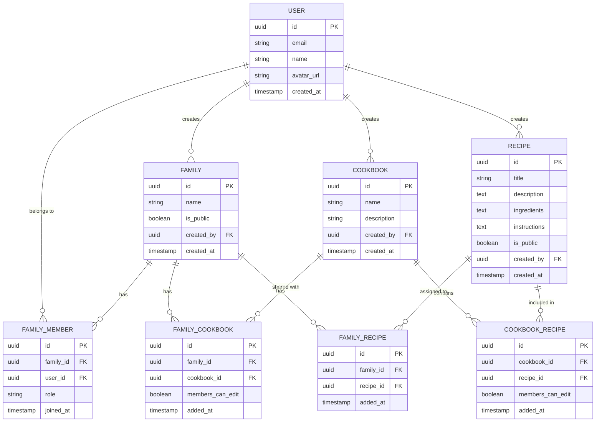

# Database Schema

## Row Level Security Policies

### `profiles`
| Policy | Command | Roles | Rule |
|--------|---------|-------|------|
| `profiles: public read` | SELECT | public | Everyone can read all profiles |
| `profiles: authenticated insert` | INSERT | authenticated | Can only insert own profile (`auth.uid() = id`) |
| `profiles: authenticated update` | UPDATE | authenticated | Can only update own profile (`auth.uid() = id`) |
| `profiles: authenticated delete` | DELETE | authenticated | Can only delete own profile (`auth.uid() = id`) |

### `families`
| Policy | Command | Roles | Rule |
|--------|---------|-------|------|
| `families: public read` | SELECT | public | Visible if public, or created by user, or user is a family member |
| `families: authenticated insert` | INSERT | authenticated | Can only insert families they own (`auth.uid() = created_by`) |
| `families: authenticated update` | UPDATE | authenticated | Can only update families they own (`auth.uid() = created_by`) |
| `families: authenticated delete` | DELETE | authenticated | Can only delete families they own (`auth.uid() = created_by`) |

### `family_members`
| Policy | Command | Roles | Rule |
|--------|---------|-------|------|
| `family_members: read` | SELECT | public | Visible if the row is for the current user, or current user is a member of the same family — implemented via `is_family_member()` security definer function to avoid self-referential RLS recursion |
| `family_members: authenticated insert` | INSERT | authenticated | Any authenticated user |
| `family_members: authenticated update` | UPDATE | authenticated | Any authenticated user |
| `family_members: authenticated delete` | DELETE | authenticated | Any authenticated user |

### `cookbooks`
| Policy | Command | Roles | Rule |
|--------|---------|-------|------|
| `cookbooks: read` | SELECT | public | Visible if created by user, or user is a member of a family that has the cookbook, or the cookbook belongs to a public family |
| `cookbooks: authenticated insert` | INSERT | authenticated | Can only insert cookbooks they own (`auth.uid() = created_by`) |
| `cookbooks: authenticated update` | UPDATE | authenticated | Can only update cookbooks they own (`auth.uid() = created_by`) |
| `cookbooks: authenticated delete` | DELETE | authenticated | Can only delete cookbooks they own (`auth.uid() = created_by`) |

### `family_cookbooks`
| Policy | Command | Roles | Rule |
|--------|---------|-------|------|
| `family_cookbooks: read` | SELECT | public | Visible if the associated family is public, created by user, or user is a member of the family |
| `family_cookbooks: authenticated insert` | INSERT | authenticated | Any authenticated user |
| `family_cookbooks: authenticated update` | UPDATE | authenticated | Any authenticated user |
| `family_cookbooks: authenticated delete` | DELETE | authenticated | Any authenticated user |

### `recipes`
| Policy | Command | Roles | Rule |
|--------|---------|-------|------|
| `recipes: public read` | SELECT | public | Visible if public, or created by user, or user is a member of a family that has the recipe, or user is a member of a family whose cookbook contains the recipe |
| `recipes: authenticated insert` | INSERT | authenticated | Can only insert recipes they own (`auth.uid() = created_by`) |
| `recipes: authenticated update` | UPDATE | authenticated | Can only update recipes they own (`auth.uid() = created_by`) |
| `recipes: authenticated delete` | DELETE | authenticated | Can only delete recipes they own (`auth.uid() = created_by`) |

### `cookbook_recipes`
| Policy | Command | Roles | Rule |
|--------|---------|-------|------|
| `cookbook_recipes: read` | SELECT | public | Visible if the cookbook is accessible (owned by user, user is a member of a family with the cookbook, or cookbook belongs to a public family) |
| `cookbook_recipes: authenticated insert` | INSERT | authenticated | Any authenticated user |
| `cookbook_recipes: authenticated update` | UPDATE | authenticated | Any authenticated user |
| `cookbook_recipes: authenticated delete` | DELETE | authenticated | Any authenticated user |

### `family_recipes`
| Policy | Command | Roles | Rule |
|--------|---------|-------|------|
| `family_recipes: read` | SELECT | public | Visible if the associated family is public, created by user, or user is a member of the family |
| `family_recipes: authenticated insert` | INSERT | authenticated | Any authenticated user |
| `family_recipes: authenticated update` | UPDATE | authenticated | Any authenticated user |
| `family_recipes: authenticated delete` | DELETE | authenticated | Any authenticated user |

---

## Helper Functions

### `is_family_member(p_family_id uuid) → boolean`
Security definer function used in RLS policies to check if `auth.uid()` is a member of the given family. Runs with elevated privileges to bypass RLS on `family_members`, preventing infinite recursion in the `family_members: read` policy.

## Triggers

### `on_auth_user_created` (on `auth.users`)
After a new user signs up, automatically inserts a row into `public.profiles` with the user's `id`. This ensures the FK constraint on `recipes.created_by → profiles.id` (and similar) is always satisfiable. A one-time backfill migration (`backfill_profiles_for_existing_users`) created profiles for all users who signed up before this trigger was added.

