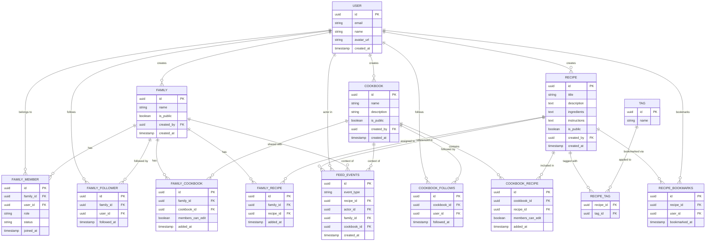

# Database Schema

## Row Level Security Policies

### `profiles`
| Policy | Command | Roles | Rule |
|--------|---------|-------|------|
| `profiles: public read` | SELECT | public | Everyone can read all profiles |
| `profiles: authenticated insert` | INSERT | authenticated | Can only insert own profile (`auth.uid() = id`) |
| `profiles: authenticated update` | UPDATE | authenticated | Can only update own profile (`auth.uid() = id`) |
| `profiles: authenticated delete` | DELETE | authenticated | Can only delete own profile (`auth.uid() = id`) |

### `families`
| Policy | Command | Roles | Rule |
|--------|---------|-------|------|
| `families: public read` | SELECT | public | Visible if public, or created by user, or user is a family member |
| `families: authenticated insert` | INSERT | authenticated | Can only insert families they own (`auth.uid() = created_by`) |
| `families: authenticated update` | UPDATE | authenticated | Can only update families they own (`auth.uid() = created_by`) |
| `families: authenticated delete` | DELETE | authenticated | Can only delete families they own (`auth.uid() = created_by`) |

### `family_members`
| Policy | Command | Roles | Rule |
|--------|---------|-------|------|
| `family_members: read` | SELECT | public | Visible if the row is for the current user, or current user is a member of the same family — implemented via `is_family_member()` security definer function to avoid self-referential RLS recursion |
| `family_members: authenticated insert` | INSERT | authenticated | Any authenticated user |
| `family_members: authenticated update` | UPDATE | authenticated | Any authenticated user |
| `family_members: authenticated delete` | DELETE | authenticated | Any authenticated user |

### `cookbooks`
| Policy | Command | Roles | Rule |
|--------|---------|-------|------|
| `cookbooks: read` | SELECT | public | Visible if created by user, or user is a member of a family that has the cookbook, or the cookbook belongs to a public family |
| `cookbooks: authenticated insert` | INSERT | authenticated | Can only insert cookbooks they own (`auth.uid() = created_by`) |
| `cookbooks: authenticated update` | UPDATE | authenticated | Can only update cookbooks they own (`auth.uid() = created_by`) |
| `cookbooks: authenticated delete` | DELETE | authenticated | Can only delete cookbooks they own (`auth.uid() = created_by`) |

### `family_cookbooks`
| Policy | Command | Roles | Rule |
|--------|---------|-------|------|
| `family_cookbooks: read` | SELECT | public | Visible if the associated family is public, created by user, or user is a member of the family |
| `family_cookbooks: authenticated insert` | INSERT | authenticated | Any authenticated user |
| `family_cookbooks: authenticated update` | UPDATE | authenticated | Any authenticated user |
| `family_cookbooks: authenticated delete` | DELETE | authenticated | Any authenticated user |

### `recipes`
| Policy | Command | Roles | Rule |
|--------|---------|-------|------|
| `recipes: public read` | SELECT | public | Visible if public, or created by user, or user is a member of a family that has the recipe, or user is a member of a family whose cookbook contains the recipe |
| `recipes: authenticated insert` | INSERT | authenticated | Can only insert recipes they own (`auth.uid() = created_by`) |
| `recipes: authenticated update` | UPDATE | authenticated | Can only update recipes they own (`auth.uid() = created_by`) |
| `recipes: authenticated delete` | DELETE | authenticated | Can only delete recipes they own (`auth.uid() = created_by`) |

### `cookbook_recipes`
| Policy | Command | Roles | Rule |
|--------|---------|-------|------|
| `cookbook_recipes: read` | SELECT | public | Visible if the cookbook is accessible (owned by user, user is a member of a family with the cookbook, or cookbook belongs to a public family) |
| `cookbook_recipes: authenticated insert` | INSERT | authenticated | Any authenticated user |
| `cookbook_recipes: authenticated update` | UPDATE | authenticated | Any authenticated user |
| `cookbook_recipes: authenticated delete` | DELETE | authenticated | Any authenticated user |

### `family_recipes`
| Policy | Command | Roles | Rule |
|--------|---------|-------|------|
| `family_recipes: read` | SELECT | public | Visible if the associated family is public, created by user, or user is a member of the family |
| `family_recipes: authenticated insert` | INSERT | authenticated | Any authenticated user |
| `family_recipes: authenticated update` | UPDATE | authenticated | Any authenticated user |
| `family_recipes: authenticated delete` | DELETE | authenticated | Any authenticated user |

### `family_followers`
| Policy | Command | Roles | Rule |
|--------|---------|-------|------|
| `family_followers_select` | SELECT | public | Anyone can read (enables public follower counts) |
| `family_followers_insert` | INSERT | authenticated | User can only insert their own row (`user_id = auth.uid()`) |
| `family_followers_delete` | DELETE | authenticated | User can only delete their own row |

### `cookbook_follows`
| Policy | Command | Roles | Rule |
|--------|---------|-------|------|
| `cookbook_follows_select` | SELECT | public | Anyone can read (enables public follow counts) |
| `cookbook_follows_insert` | INSERT | authenticated | User can only insert their own row (`user_id = auth.uid()`) |
| `cookbook_follows_delete` | DELETE | authenticated | User can only delete their own row |

### `recipe_bookmarks`
| Policy | Command | Roles | Rule |
|--------|---------|-------|------|
| `recipe_bookmarks_select` | SELECT | authenticated | User can only read their own bookmarks |
| `recipe_bookmarks_insert` | INSERT | authenticated | User can only insert their own row |
| `recipe_bookmarks_delete` | DELETE | authenticated | User can only delete their own row |

### `feed_events`
| Policy | Command | Roles | Rule |
|--------|---------|-------|------|
| `feed_events_select` | SELECT | authenticated | Any authenticated user can read all events; per-recipe visibility enforced in `get_feed()` |

> ⚠️ No INSERT/UPDATE/DELETE policies — the app never writes to `feed_events` directly. All inserts happen via `SECURITY DEFINER` trigger functions.

### `tags`
| Policy | Command | Roles | Rule |
|--------|---------|-------|------|
| `tags: public read` | SELECT | public | Everyone can read all tags |
| `tags: authenticated insert` | INSERT | authenticated | Any authenticated user can create tags |

### `recipe_tags`
| Policy | Command | Roles | Rule |
|--------|---------|-------|------|
| `recipe_tags: public read` | SELECT | public | Everyone can read all recipe–tag associations |
| `recipe_tags: authenticated insert` | INSERT | authenticated | Any authenticated user can insert (recipe RLS controls access) |
| `recipe_tags: authenticated delete` | DELETE | authenticated | Any authenticated user can delete (recipe RLS controls access) |

## Helper Functions

### `is_family_member(p_family_id uuid) → boolean`
Security definer function used in RLS policies to check if `auth.uid()` is a member of the given family. Runs with elevated privileges to bypass RLS on `family_members`, preventing infinite recursion in the `family_members: read` policy.

### `get_feed(p_user_id uuid, p_cursor timestamptz, p_limit int, p_filter text) → SETOF`
`SECURITY DEFINER`, `SET search_path = ''`. Returns a paginated, ranked feed of `feed_events` joined with recipe, actor, family, and cookbook data.

**Parameters:**
| Parameter | Default | Description |
|-----------|---------|-------------|
| `p_user_id` | — | Calling user's UUID; pass `null` for unauthenticated users |
| `p_cursor` | `now()` | Exclusive upper bound on `created_at`; pass last event's timestamp for next page |
| `p_limit` | `20` | Page size |
| `p_filter` | `'all'` | Source filter: `'all'` \| `'families'` \| `'following'` \| `'public'` |

**Scoring:** `score = W + D`
- **W (relationship weight):** member of source family = 4 · following source family = 3 · following source cookbook = 2 · bookmarked the recipe = 1 · no relationship = 0
- **D (recency decay):** `1 / (1 + hours_since_event / 48)`

Sorted `score DESC, created_at DESC`. Visibility enforced in the WHERE clause (public recipes, own recipes, or recipes in a family the caller belongs to).

## Triggers

### `on_auth_user_created` (on `auth.users`)
After a new user signs up, automatically inserts a row into `public.profiles` with the user's `id`. This ensures the FK constraint on `recipes.created_by → profiles.id` (and similar) is always satisfiable. A one-time backfill migration (`backfill_profiles_for_existing_users`) created profiles for all users who signed up before this trigger was added.

### Phase 6 feed triggers (on `public.recipes`, `public.family_recipes`, `public.cookbook_recipes`)
All three are `SECURITY DEFINER`, `SET search_path = ''` to safely write into `feed_events` bypassing RLS.

| Trigger | Table | Event | Feed event type |
|---------|-------|-------|-----------------|
| `trg_feed_event_recipe_created` | `recipes` | AFTER INSERT | `recipe_created` |
| `trg_feed_event_recipe_added_to_family` | `family_recipes` | AFTER INSERT | `recipe_added_to_family` |
| `trg_feed_event_recipe_added_to_cookbook` | `cookbook_recipes` | AFTER INSERT | `recipe_added_to_cookbook` |

> **Note:** A one-time `backfill_feed_events` migration was applied to seed `feed_events` for all data that existed before these triggers were created (29 `recipe_created`, 20 `recipe_added_to_cookbook`, 1 `recipe_added_to_family`).

## Future Schema (not yet applied)

### `family_pending_email_invites`
| Policy | Command | Roles | Rule |
|--------|---------|-------|------|
| `family_pending_email_invites: member read` | SELECT | authenticated | Readable by the user who created the invite (`invited_by = auth.uid()`) |
| `family_pending_email_invites: authenticated insert` | INSERT | authenticated | Any active family member can insert (`invited_by = auth.uid()`) |
