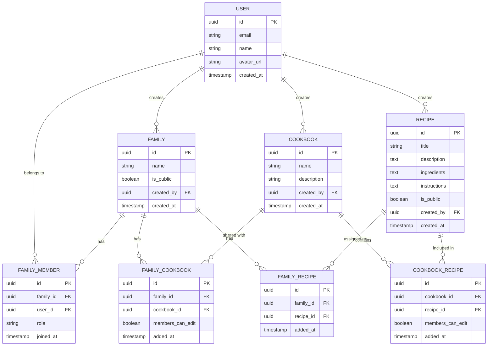

# Database Schema

```mermaid
erDiagram
    USER {
        uuid id PK
        string email
        string name
        string avatar_url
        timestamp created_at
    }

    FAMILY {
        uuid id PK
        string name
        boolean is_public
        uuid created_by FK
        timestamp created_at
    }

    FAMILY_MEMBER {
        uuid id PK
        uuid family_id FK
        uuid user_id FK
        string role
        timestamp joined_at
    }

    COOKBOOK {
        uuid id PK
        string name
        string description
        uuid created_by FK
        timestamp created_at
    }

    FAMILY_COOKBOOK {
        uuid id PK
        uuid family_id FK
        uuid cookbook_id FK
        boolean members_can_edit
        timestamp added_at
    }

    RECIPE {
        uuid id PK
        string title
        text description
        text ingredients
        text instructions
        boolean is_public
        uuid created_by FK
        timestamp created_at
    }

    COOKBOOK_RECIPE {
        uuid id PK
        uuid cookbook_id FK
        uuid recipe_id FK
        boolean members_can_edit
        timestamp added_at
    }

    FAMILY_RECIPE {
        uuid id PK
        uuid family_id FK
        uuid recipe_id FK
        timestamp added_at
    }

    USER ||--o{ FAMILY : "creates"
    USER ||--o{ FAMILY_MEMBER : "belongs to"
    FAMILY ||--o{ FAMILY_MEMBER : "has"
    USER ||--o{ COOKBOOK : "creates"
    USER ||--o{ RECIPE : "creates"
    COOKBOOK ||--o{ COOKBOOK_RECIPE : "contains"
    RECIPE ||--o{ COOKBOOK_RECIPE : "included in"
    FAMILY ||--o{ FAMILY_COOKBOOK : "has"
    COOKBOOK ||--o{ FAMILY_COOKBOOK : "shared with"
    FAMILY ||--o{ FAMILY_RECIPE : "has"
    RECIPE ||--o{ FAMILY_RECIPE : "assigned to"
```
